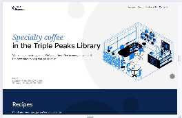

# Triple Peaks Coffee Shop

This is the second project of the Software Engineering program at TripleTen. It was created using HTML and CSS, based on the design brief.

## Project features

- Semantic HTML5
- Flexbox
- Positioning
- Flat BEM file structure
- A custom form
- CSS animation and transform

## Plan on improving the project

- Customize checkbox _(suggestion can be found in stage 2 brief)_
- Place a creamer design in some of the circles in the design to bring out more of that "coffee" look. Also, animate the design to pulsate inside the cup.

## Project preview

[## URL link](https://jakanoh17.github.io/se_project_coffeeshop)
